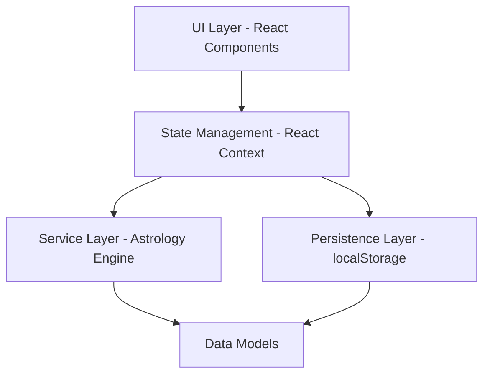

# Design Document: Astrology App

## Overview

The Astrology App is a client-side web application built with TypeScript and React that generates personalized astrological insights from user birth details. The app calculates zodiac signs, natal chart positions, lucky/unlucky factors, and identifies auspicious and cautionary dates on an interactive calendar. All data is persisted locally via browser localStorage.

The application is entirely frontend-based with no backend server. Astrological calculations (zodiac determination, natal chart approximation, factor derivation, and date classification) are performed in-browser using deterministic algorithms based on astronomical data.

## Architecture

The app follows a layered architecture:



**Layers:**

1. **UI Layer**: React components for profile input, factor display, calendar view, and daily summary.
2. **State Management**: React Context providing app-wide access to the active profile and computed astrological data.
3. **Service Layer**: Pure functions for zodiac determination, natal chart calculation, factor derivation, and date classification.
4. **Persistence Layer**: Abstraction over localStorage for profile CRUD operations with error handling.
5. **Data Models**: TypeScript interfaces and types shared across all layers.

**Key Design Decisions:**

- **Client-side only**: No backend needed since all calculations are deterministic and data is local.
- **Pure computation layer**: Astrological calculations are implemented as pure functions, making them testable and independent of UI.
- **localStorage for persistence**: Satisfies the requirement for local profile persistence that survives app closure.

## Components and Interfaces

### UI Components

```mermaid
graph TD
    App[App] --> Router{Has Profile?}
    Router --> ProfileInput[ProfileInputForm]
    Router --> Dashboard[Dashboard]
    Dashboard --> DailySummary[DailySummary]
    Dashboard --> FactorsPanel[FactorsPanel]
    Dashboard --> CalendarView[CalendarView]
    FactorsPanel --> LuckyFactors[LuckyFactorsDisplay]
    FactorsPanel --> UnluckyFactors[UnluckyFactorsDisplay]
    CalendarView --> MonthNav[MonthNavigation]
    CalendarView --> DateGrid[DateGrid]
    CalendarView --> DateDetail[DateDetailPopover]
    Dashboard --> ProfileActions[ProfileActions - Edit/Delete]
```



### Service Interfaces

```typescript
// Zodiac Service
interface ZodiacService {
  determineSign(dateOfBirth: string): ZodiacSign;
  getSignDescription(sign: ZodiacSign): string;
}

// Natal Chart Service
interface NatalChartService {
  calculate(profile: BirthProfile): NatalChart;
}

// Factors Service
interface FactorsService {
  deriveLuckyFactors(sign: ZodiacSign, chart: NatalChart): LuckyFactors;
  deriveUnluckyFactors(sign: ZodiacSign, chart: NatalChart): UnluckyFactors;
}

// Calendar Service
interface CalendarService {
  classifyDate(date: string, chart: NatalChart): DateClassification;
  getMonthDates(year: number, month: number, chart: NatalChart): MonthCalendarData;
  getDateSummary(date: string, chart: NatalChart): DateSummary;
}

// Profile Persistence Service
interface ProfilePersistenceService {
  save(profile: BirthProfile): Result<void, PersistenceError>;
  load(): Result<BirthProfile | null, PersistenceError>;
  delete(): void;
}
```

### Validation Module

```typescript
interface ValidationResult {
  valid: boolean;
  errors: ValidationError[];
}

interface ProfileValidator {
  validateName(name: string): ValidationResult;
  validateDateOfBirth(dob: string): ValidationResult;
  validateBirthTime(time: string): ValidationResult;
  validateLocation(location: string | undefined): ValidationResult;
  validateProfile(profile: Partial<BirthProfile>): ValidationResult;
}
```

## Data Models

```typescript
// Core profile
interface BirthProfile {
  name: string;              // 1-100 chars, alphabetic + spaces
  dateOfBirth: string;       // YYYY-MM-DD format, 1900-01-01 to today
  birthTime: string;         // HH:MM 24-hour format
  location?: string;         // Optional, max 200 chars
}

// Zodiac
type ZodiacSign = 
  | 'aries' | 'taurus' | 'gemini' | 'cancer' 
  | 'leo' | 'virgo' | 'libra' | 'scorpio' 
  | 'sagittarius' | 'capricorn' | 'aquarius' | 'pisces';

interface ZodiacInfo {
  sign: ZodiacSign;
  description: string;       // 1-3 sentences
}

// Natal Chart
interface NatalChart {
  sunSign: ZodiacSign;
  moonPosition: number;      // Degree 0-359
  ascendant?: ZodiacSign;    // Only with location
  planetaryPositions: PlanetaryPosition[];
  reducedPrecision: boolean; // True when location is missing
}

interface PlanetaryPosition {
  planet: Planet;
  degree: number;            // 0-359
  sign: ZodiacSign;
}

type Planet = 'sun' | 'moon' | 'mercury' | 'venus' | 'mars' 
            | 'jupiter' | 'saturn';

// Factors
interface LuckyFactors {
  numbers: LuckyItem[];      // 1-3 items
  colors: LuckyItem[];       // 1-3 items
  days: LuckyItem[];         // 1-2 items
  gemstones: LuckyItem[];    // 1-2 items
}

interface UnluckyFactors {
  numbers: UnluckyItem[];    // 1-3 items
  colors: UnluckyItem[];     // 1-3 items
  days: UnluckyItem[];       // 1-2 items
}

interface LuckyItem {
  value: string;
  explanation: string;       // Max 200 characters
}

interface UnluckyItem {
  value: string;
  explanation: string;       // Max 2 sentences
}

// Calendar
type DateClassification = 'lucky' | 'caution' | 'both' | 'neutral';

interface MonthCalendarData {
  year: number;
  month: number;             // 1-12
  dates: CalendarDate[];
}

interface CalendarDate {
  date: string;              // YYYY-MM-DD
  classification: DateClassification;
}

interface DateSummary {
  date: string;
  classification: DateClassification;
  luckySummary?: string;     // Why the date is auspicious
  cautionSummary?: string;   // 50-500 chars, why to avoid decisions
}

// Daily Summary
interface DailySummary {
  date: string;
  classification: DateClassification;
  guidance: string;
  relevantFactors: LuckyItem[] | UnluckyItem[];
}

// Error handling
type Result<T, E> = { ok: true; value: T } | { ok: false; error: E };

type PersistenceError = 'storage_full' | 'corrupted_data' | 'unavailable';

interface ValidationError {
  field: string;
  message: string;
}
```

## Correctness Properties

*A property is a characteristic or behavior that should hold true across all valid executions of a system—essentially, a formal statement about what the system should do. Properties serve as the bridge between human-readable specifications and machine-verifiable correctness guarantees.*

### Property 1: Profile persistence round-trip

*For any* valid BirthProfile, saving it to the persistence layer and then loading it back should produce an object identical to the original profile.

**Validates: Requirements 1.3, 7.1**

### Property 2: Missing field validation

*For any* partial BirthProfile with at least one required field (name, dateOfBirth, or birthTime) missing, validation should return errors that identify exactly the missing fields, and should not report errors for fields that are present and valid.

**Validates: Requirements 1.4**

### Property 3: Invalid format rejection

*For any* string that does not match the YYYY-MM-DD date format or represents an invalid calendar date, date validation should reject it. Similarly, *for any* string that does not match the HH:MM 24-hour format or represents a time outside 00:00–23:59, time validation should reject it.

**Validates: Requirements 1.5, 1.6**

### Property 4: Zodiac sign determination correctness

*For any* valid date of birth, the determined zodiac sign should be the one whose standard Western tropical date range contains that birth date, and every date should map to exactly one sign.

**Validates: Requirements 2.1**

### Property 5: Zodiac description format

*For any* valid date of birth, the zodiac sign description returned should be between 1 and 3 sentences (non-empty, containing 1 to 3 sentence-terminating punctuation marks).

**Validates: Requirements 2.2**

### Property 6: Natal chart precision reflects location presence

*For any* valid BirthProfile with a location, the calculated NatalChart should have `reducedPrecision` set to false and an ascendant present. *For any* valid BirthProfile without a location, the NatalChart should have `reducedPrecision` set to true.

**Validates: Requirements 2.3, 2.4**

### Property 7: Lucky factors count constraints

*For any* valid NatalChart, the derived LuckyFactors should contain 1–3 lucky numbers, 1–3 lucky colors, 1–2 lucky days, and 1–2 lucky gemstones.

**Validates: Requirements 3.1**

### Property 8: Lucky factor explanation length

*For any* valid NatalChart, every explanation string in the derived LuckyFactors should be at most 200 characters.

**Validates: Requirements 3.3**

### Property 9: Unlucky factors count constraints

*For any* valid NatalChart, the derived UnluckyFactors should contain 1–3 unfavorable numbers, 1–3 unfavorable colors, and 1–2 unfavorable days.

**Validates: Requirements 4.1**

### Property 10: Unlucky factor explanation length

*For any* valid NatalChart, every explanation string in the derived UnluckyFactors should be at most 2 sentences.

**Validates: Requirements 4.3**

### Property 11: Calendar produces valid date classifications

*For any* valid NatalChart and any month within the navigable range, the calendar service should produce a classification for every day of that month, and each classification must be one of: 'lucky', 'caution', 'both', or 'neutral'.

**Validates: Requirements 5.1, 6.1**

### Property 12: Calendar navigation accepts valid range

*For any* month offset from -12 to +12 relative to the current month, the calendar navigation should accept the request. *For any* offset outside this range, the navigation should reject the request.

**Validates: Requirements 5.2, 6.4**

### Property 13: Date summaries match classification

*For any* date classified as 'lucky', a non-empty lucky summary should be available. *For any* date classified as 'caution', a summary between 50 and 500 characters should be available. *For any* date classified as 'both', both a lucky summary and a caution summary (50–500 chars) should be available.

**Validates: Requirements 5.3, 6.3, 6.5**

### Property 14: Daily summary classification validity

*For any* valid BirthProfile and any date, the daily summary classification should be one of 'lucky', 'caution', 'both', or 'neutral', and should match the classification produced by the calendar service for the same date.

**Validates: Requirements 8.1**

### Property 15: Daily guidance references matching factors

*For any* date classified as 'lucky', the daily guidance text should reference at least one of the user's lucky factor values. *For any* date classified as 'caution', the daily guidance text should reference at least one of the user's unlucky factor values.

**Validates: Requirements 8.2, 8.3**

### Property 16: Profile change triggers recalculation determinism

*For any* two distinct valid BirthProfiles with birth dates in different zodiac sign ranges, the computed astrological data (zodiac sign, factors, and date classifications) should differ.

**Validates: Requirements 7.5**


## Error Handling

### Validation Errors

| Error Scenario | Handling Strategy |
|---|---|
| Missing required field | Return `ValidationError` with field name and "required" message. Do not clear other fields. |
| Invalid date format | Return `ValidationError` with message specifying expected YYYY-MM-DD format |
| Invalid date value (e.g., Feb 30) | Return `ValidationError` indicating the date is not a valid calendar date |
| Invalid time format | Return `ValidationError` with message specifying expected HH:MM 24-hour format |
| Name contains invalid characters | Return `ValidationError` indicating only alphabetic characters and spaces are allowed |
| Name exceeds 100 characters | Return `ValidationError` indicating maximum length exceeded |
| Location exceeds 200 characters | Return `ValidationError` indicating maximum length exceeded |

### Persistence Errors

| Error Scenario | Handling Strategy |
|---|---|
| localStorage unavailable | Display error message, retain entered data in form, allow retry |
| localStorage full | Display error message indicating storage is full, suggest clearing browser data |
| Corrupted saved data | Display error indicating profile could not be loaded, show fresh input form |
| JSON parse failure on load | Treat as corrupted data, clear invalid entry, show input form |

### Computation Errors

| Error Scenario | Handling Strategy |
|---|---|
| Lucky factors cannot be derived | Display specific error message suggesting user verify birth details |
| Unlucky factors cannot be derived | Display message indicating unlucky factors are unavailable |
| Date classification fails | Classify date as 'neutral' and log warning |

### Error Design Principles

1. **Graceful degradation**: Computation failures should not crash the app; display informative messages.
2. **Data preservation**: On save failures, never clear user input.
3. **Explicit messaging**: Error messages should tell the user what went wrong and what to do.
4. **Type safety**: Use `Result<T, E>` return types for operations that can fail, ensuring error handling is enforced at compile time.

## Testing Strategy

### Property-Based Testing

**Library**: [fast-check](https://github.com/dubzzz/fast-check) (TypeScript property-based testing library)

**Configuration**: Minimum 100 iterations per property test.

**Tag format**: Each property test is tagged with a comment:
```
// Feature: astrology-app, Property {N}: {property_text}
```

**Properties to implement** (each as a single property-based test):
- Property 1: Profile persistence round-trip
- Property 2: Missing field validation
- Property 3: Invalid format rejection
- Property 4: Zodiac sign determination correctness
- Property 5: Zodiac description format
- Property 6: Natal chart precision reflects location presence
- Property 7: Lucky factors count constraints
- Property 8: Lucky factor explanation length
- Property 9: Unlucky factors count constraints
- Property 10: Unlucky factor explanation length
- Property 11: Calendar produces valid date classifications
- Property 12: Calendar navigation accepts valid range
- Property 13: Date summaries match classification
- Property 14: Daily summary classification validity
- Property 15: Daily guidance references matching factors
- Property 16: Profile change triggers recalculation determinism

### Unit Tests (Example-Based)

Focus areas:
- **Form rendering**: Verify input fields exist with correct attributes (1.1, 1.2)
- **Storage failure handling**: Mock localStorage to throw, verify error display (1.7)
- **Factor derivation failure**: Mock service to fail, verify error messages (3.4, 4.4)
- **Visual indicators**: Verify distinct CSS classes for lucky, caution, and neutral dates (5.4, 6.2)
- **Profile CRUD**: Edit populates fields (7.3), delete prompts confirmation (7.4)
- **Load performance**: Verify profile loads within 3 seconds (7.2)
- **App startup states**: No profile shows creation prompt (8.5), neutral day shows neutral message (8.4)

### Edge Case Tests

- Month with no lucky dates shows appropriate message (5.5)
- Month with no caution dates shows appropriate message (6.6)
- Corrupted localStorage data triggers error recovery (7.6)
- Date that qualifies as both lucky and caution shows both indicators (6.5 - also covered by Property 13)

### Integration Tests

- Full flow: enter profile → save → reload app → verify all data displayed correctly
- Edit flow: load saved profile → edit birth date → verify recalculated results
- Delete flow: delete profile → confirm → verify input screen shown

### Test Runner

- **Framework**: Vitest
- **Component testing**: React Testing Library
- **Coverage target**: 90% line coverage on service layer, 80% overall
